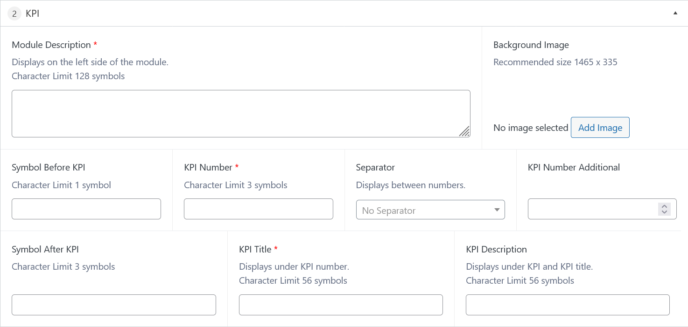
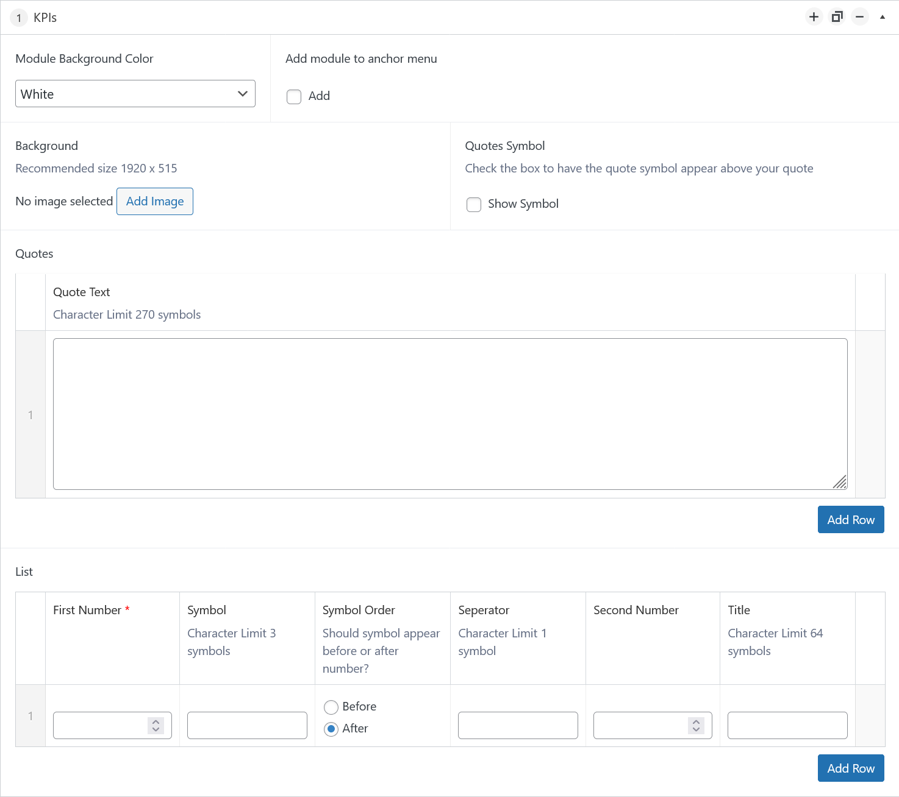

# KPI Animation Accessibility Enhancement

This project is an isolated module from a larger WordPress multisite environment at High Point University, using the Advanced Custom Fields (ACF) plugin. It highlights my expertise in PHP and JavaScript and my expereince in developing for assistive technologies like NVDA screen readers. My task was to rewrite the code for two KPI modules to bring the dynamic content up to the university's high standard for accessiblity without losing customization or visual appeal. 

An isolated showcase of the functionality is available [here](https://shueue.github.io/kpi-animate/working-example/index.html), or it can be tested live on the HPU site [here](https://www.highpoint.edu/discoverhpu/#anchor-experiential-learning).

## CSS Contribution

While this project primarily focused on PHP and JavaScript, the extracted module for this showcase required recreating its CSS from scratch. You can explore the CSS details in `working-example/assets/style.css`.

## Task
The primary goal was to resolve an accessibility issue where assistive technologies announced only the starting value (`0`) or every number during the animation (e.g., counting from `0` to `99`). The fix required screen readers to announce only the final value dynamically populated by ACF. 

Additionally, the animation had to pause when users navigated to it via keyboard and correctly read the final value in a user-friendly format (e.g. `$99,000` read as "ninety thousand dollars"). Both the `KPI` and `KPIs` modules required updates to their `view.php` templates and the underlying JavaScript logic. 

I also took the opportunity to reorganize and streamline the ACF input fields for better usability by content managers.

## Challenge
Several challenges arose during this project:

1. **PHP Overhaul:** 
   - The `view.php` files required extensive rewrites for improved readability, streamlined logic, and better variable management.
   - Security updates like input sanitization were added where missing.

2. **JavaScript Rewrite:**
   - The animation relied on jQuery, which didn't allow for the ability to stop the animation during keyboard navigation. Rewriting it in vanilla JavaScript allowed for better control and improved the module's speed performance.

3. **Screen Reader Behavior:**
   - Achieving consistent, user-friendly screen reader output across browsers and assistive technologies required building a JavaScript function to combine all the optional componets of the KPI into a single `aria-label`.

4. **User-Friendly Editing:** 
   - ACF fields lacked clarity for content managers. Updating the field structure and adding helpful instructions reduced confusion and improved usability.

## Solution
1. **PHP Updates:**
   - I reorganized the `view.php` files, consolidating inline HTML/PHP into modular and readable code. 
   - Sanitized user inputs for security and added `tabindex` attributes to ensure keyboard navigation included all relevant content.
   - Enhanced ACF fields by restructuring confusing inputs, such as converting the `kpi_separator` field into a dropdown menu (`'type' => 'select'`), and adding clear instructions for content managers.

2. **JavaScript Rewrite:**
   - Replaced the jQuery animation logic with vanilla JavaScript to ensure full control over the counting animation.
   - Added a `focus` event to pause the animation during keyboard navigation and dynamically read out the final number using `aria-label`.

3. **Screen Reader Optimization:**
   - Built a constructor in JavaScript to combine separate KPI spans (`symbol-before`, `main-number`, `separator`, etc.) into a single, coherent `aria-label`.
   - Silenced interim counting announcements to ensure assistive technologies only read the final value.

## Outcome
The KPI modules are now fully accessible, allowing screen readers to deliver a clear, user-friendly output (e.g., "ninety thousand dollars"). The keyboard navigation is seamless, and content managers report reduced confusion when editing the module. This success showcases my ability to troubleshoot and optimize existing code for accessibility and performance.

## Editor-Side View of ACF Options
Final KPI View 

Final KPIs View 

## Directory Structure
- **assets/**: Contains global styles and scripts for the KPI feature.
- **modules/**: Includes PHP logic and templates for rendering KPI modules within a WordPress environment.
  - `kpi/`: Handles the singular KPI logic and display.
  - `kpis/`: Manages KPI variation with multiple KPIs in the same module.
- **working-example/**: A standalone demo showing the feature in action without requiring WordPress.
- **README.md**: Project overview, setup instructions, and contributions.
